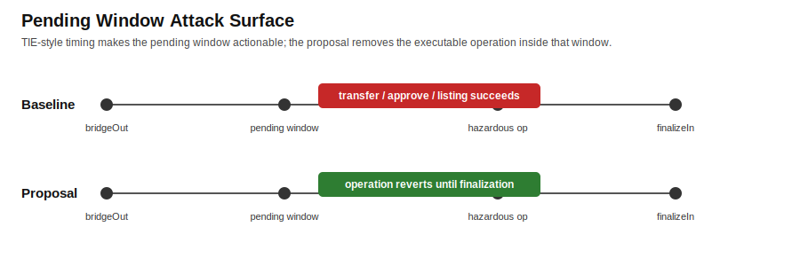
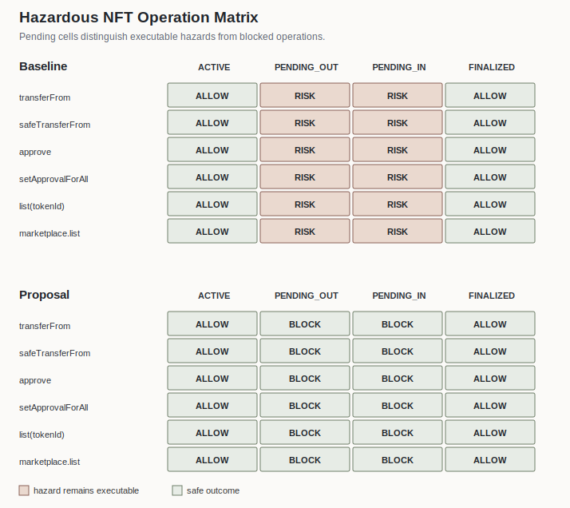
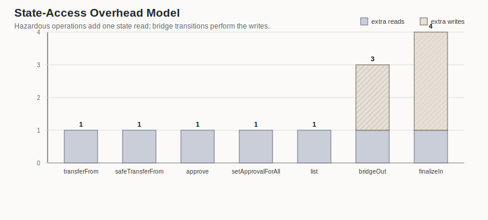

# FIT2026 Cross-Chain NFT Operation Guards

[](https://github.com/black-leg-nameko/fit2026-cross-chain-nft-guards/actions/workflows/experiments.yml)

This repository contains the proof-of-concept implementation for the FIT2026
paper "Defining and Preventing Hazardous Operations under Ownership
Inconsistency in Cross-chain NFTs".

## Main Result

The primary experiment is a real two-chain local EVM execution with Docker
Compose and Anvil. Across relay delays of **0, 1, 3, and 10 seconds** after
`bridgeOut` on chain A, the baseline permits **6/6** hazardous source-chain
operations, while the proposal rejects **6/6**. Destination finalization is then
executed on chain B, normal destination transfer succeeds, and replay
finalization is rejected by the proposal.

Evidence levels:

- `scripts/run_multichain_anvil.sh` launches two Anvil chains, deploys source
  and destination contracts, executes the asynchronous relay-window experiment,
  and writes transaction-level results.
- `scripts/run_delay_sweep.sh` repeats the two-chain experiment across relay
  delays and writes aggregate CSV/Markdown summaries for the paper evidence.
- `test/ScenarioMatrix.t.sol` checks the Solidity contracts at EVM level,
  including both `PENDING_OUT` and `PENDING_IN` guards and replay rejection.
- `test/PendingGuardInvariant.t.sol` adds stateful fuzz tests over 64 seeds and
  32-step operation sequences, checking that no pending hazardous operation
  succeeds and that per-owner pending counters stay synchronized with token
  states.
- `scripts/run_experiments.js` generates the publication matrix and figures
  from an executable model covering 12 pending-state cases.
- `figures/state_access_overhead.svg` is a storage-access model, while
  `reports/foundry_gas_report.txt` records the measured Foundry gas report.





The experiment is designed to show three properties:

- **Safety:** pending-state transfer, approval, and listing operations are rejected.
- **Availability:** the same operations are allowed in `ACTIVE` and after finalization.
- **Lightweight guard:** normal hazardous operations add one state read; writes occur only on bridge state transitions.



The PoC compares:

- `BaselineNFT`: a naive cross-chain NFT that emits bridge events but keeps
  ownership-dependent NFT operations available while a bridge transfer is
  pending.
- `SafeCrossChainNFT`: a state-aware NFT that tracks `ACTIVE`, `PENDING_OUT`,
  and `PENDING_IN` per token and rejects hazardous operations during pending
  states.
- `MockMarketplace`: a minimal bridge-aware marketplace that treats listing as
  an ownership-dependent operation.

## Hazardous Operations

The implementation evaluates six concrete entry points across the three
operation classes used in the paper:

- transfer: `transferFrom`, `safeTransferFrom`
- approval: `approve`, `setApprovalForAll`
- listing: direct `list(tokenId)` and marketplace listing through `canList(tokenId)`

States:

- `ACTIVE`
- `PENDING_OUT`
- `PENDING_IN`
- post-finalization `ACTIVE`

## Reproduce Experiments

Dependency-free local run:

```bash
node scripts/run_experiments.js
```

Full local check:

```bash
sh scripts/run_all.sh
```

With Docker Desktop and WSL integration enabled:

```bash
docker compose run --rm experiments
```

Run the Solidity scenario tests and gas report in Docker:

```bash
docker compose run --rm foundry
```

Run the actual two-chain Anvil experiment:

```bash
docker compose up --abort-on-container-exit --exit-code-from multichain multichain
```

This launches two local EVM chains, deploys source/destination NFTs, waits
during a simulated relay delay, attempts hazardous source-chain operations, and
then finalizes the transfer on the destination chain.

Run the relay-delay sweep:

```bash
sh scripts/run_delay_sweep.sh
```

Use `DELAYS` to change the sweep points:

```bash
DELAYS="0 2 5" sh scripts/run_delay_sweep.sh
```

Latest two-chain delay sweep:

| Relay delay (s) | Baseline pending allowed | Proposal pending rejected | Baseline destination finalized | Proposal destination finalized | Proposal replay rejected |
| ---: | --- | --- | --- | --- | --- |
| 0 | 6/6 | 6/6 | 1/1 | 1/1 | 1/1 |
| 1 | 6/6 | 6/6 | 1/1 | 1/1 | 1/1 |
| 3 | 6/6 | 6/6 | 1/1 | 1/1 | 1/1 |
| 10 | 6/6 | 6/6 | 1/1 | 1/1 | 1/1 |

Generated outputs:

- `reports/experiment_report.md`
- `reports/delay_sweep_report.md`
- `reports/multichain_experiment_report.md`
- `reports/multichain_delay_*s/multichain_experiment_report.md`
- `reports/foundry_gas_report.txt`
- `results/delay_sweep_summary.csv`
- `results/multichain/summary.json`
- `results/multichain/operation_results.csv`
- `results/multichain_delay_*s/summary.json`
- `results/multichain_delay_*s/operation_results.csv`
- `results/operation_matrix.json`
- `results/experiment_summary.json`
- `results/replay_report.json`
- `results/state_access_overhead.json`
- `figures/operation_matrix.svg`
- `figures/pending_window_timeline.svg`
- `figures/state_access_overhead.svg`

## Solidity Checks

The Node experiment generates the paper figures from a small executable model.
The Solidity contracts themselves are checked separately. At minimum, parse the
contracts with plain `solc`:

```bash
solc --stop-after parsing src/BaselineNFT.sol src/SafeCrossChainNFT.sol src/MockMarketplace.sol test/ScenarioMatrix.t.sol
```

For executable EVM-level tests, use Foundry locally or through Docker:

```bash
forge test --gas-report
```

```bash
docker compose run --rm foundry
```

The current Foundry suite contains 10 tests: five deterministic scenario tests
and five fuzz/stateful tests. The fuzz checks cover pending-out rejection,
pending-in rejection, post-finalization availability, per-owner operator
approval scoping, and random 32-step operation sequences.

## Scenario Check

The repository includes a dependency-free Node.js scenario runner that mirrors
the paper's comparison table:

```bash
node scripts/run_scenarios.js
```

It writes `results/scenario_report.json` and prints whether each pending-state
operation succeeds in the baseline and is rejected by the proposal.

## Expected Result

| Scenario | Baseline | Proposal |
| --- | --- | --- |
| pending transfer | succeeds | rejected |
| pending approve | succeeds | rejected |
| pending listing | succeeds | rejected |
| transfer after finalize | succeeds | succeeds |
| replay finalize | accepted | rejected |

This PoC intentionally abstracts bridge signature verification and public-chain
validator behavior. It focuses on ownership-state semantics and operation guards
under a reproducible two-chain local EVM threat model.
